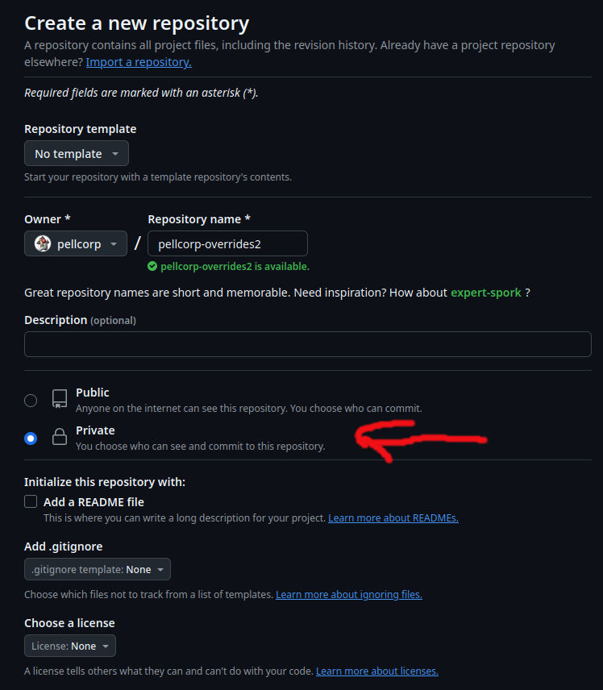

The `/usr/data/pellcorp-overrides` stores custom cfg and conf files as well as customisations you have made to some of the core config files such as printer.cfg.  

The following core config files can have overrides saved for them, please note that except for printer.cfg, fan_control.cfg and moonraker.conf no config files support adding and deleting sections, no support is provided to edit gcode_macro `gcode` values.   Except for printer.cfg, fan_control.cfg and moonraker.conf you also cannot add or delete values from existing sections, only change existing values.

- printer.cfg
- sensorless.cfg
- bltouch-k1.cfg
- bltouch-k1m.cfg
- microprobe-k1.cfg
- microprobe-k1m.cfg
- cartographer.cfg
- cartographer.conf
- cartographer-k1.cfg
- cartographer-k1m.cfg
- btteddy.cfg
- btteddy-k1.cfg
- btteddy-k1m.cfg
- beacon.conf
- beacon.cfg
- beacon-k1.cfg
- beacon-k1m.cfg
- eddyng.cfg
- klicky.cfg
- klicky-k1.cfg
- klicky-k1m.cfg
- klicky_macro.cfg
- KAMP_Settings.cfg
- moonraker.conf
- start_end.cfg
- fan_control.cfg

!!! tip

    You should run the CONFIG_OVERRIDES macro every time you make any changes to either your own custom cfg or conf files, or make changes to any core config files.  There is no process monitoring your config directory for changes, this is Simple AF after all, and automatically doing stuff is not simple af!

!!! note

    The first step in both a `/usr/data/pellcorp/k1/installer.sh --update` or `/usr/data/pellcorp/k1/installer.sh  --reinstall` is to backup your config-overrides, so that they can be reapplied, but they will be lost if you do a factory reset.

## Git Backups for Configuration Overrides

If the /usr/data/pellcorp-overrides is a git repo, calling the CONFIG_OVERRIDES or `/usr/data/pellcorp/k1/config-overrides.sh` will generate a new git commit and push it to origin if any files are changed.

### Create repository

Create a new `pellcorp-overrides` repository on your github account:



!!! info

    You don't actually have to call it pellcorp-overrides, you can call it whatever you want, but it should be a repository dedicated to just doing backups for this project.

!!! warn

    Set your new repository to be private unless you want to share settings with everyone else, or potentially sensitive information in the moonraker.conf, notifier.conf, etc.  Be really careful with using github keys in moonraker.conf update manager too, as these will be version controlled.   If possible put all your secrets in moonraker.secrets which is not saved to version control.

### Create a personal access token

Click [here](https://github.com/settings/tokens?type=beta) to create a fine grained personal access token.  Create a finegrained token and limit its access to just your `pellcorp-overrides` repository.   Make sure that Contents read and write access.


Make sure you limit it to just the new repository you created:


**Source:** <https://guilouz.github.io/Creality-Helper-Script-Wiki/helper-script/git-backup/>

### Create Local Repo

You will need 3 pieces of information for this process to succeed:

1. Your github username
2. Your email address
3. The github token you just created

Ssh into your k1 and run the following:

```
export GITHUB_USERNAME=myusername
export EMAIL_ADDRESS=me@somewhere.com
export GITHUB_TOKEN="The token I just created"
export GITHUB_REPO=pellcorp-overrides
export GITHUB_BRANCH=main
/usr/data/pellcorp/k1/config-overrides.sh --repo
```

!!! note

    The `GITHUB_BRANCH` is optional, if its not specified it will use `main` as the branch.

If you want to setup the repository locally ignoring any local files in `/usr/data/pellcorp-overrides`, you can use the `--clean-repo` argument, instead of the `--repo` argument, which will rebase the local changes on top of the repo.

!!! note

    The `moonraker.secrets` file is not versioned controlled.

### Troubleshooting

#### Support for password authentication was removed on August 13, 2021


This most likely means your personal access token is misconfigured, deleted, or expired
